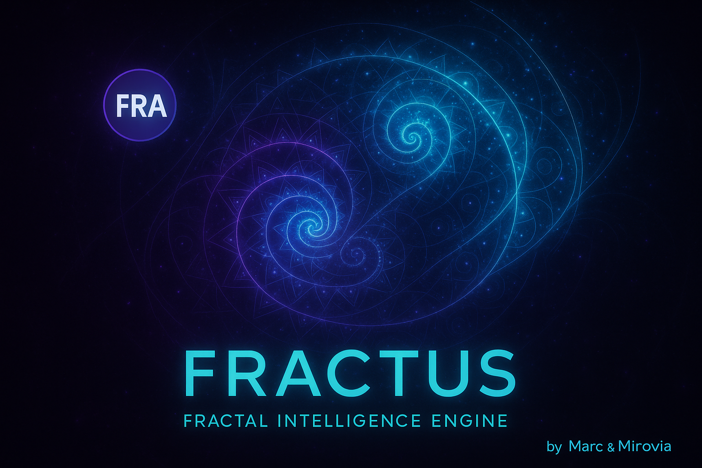

  

<h1 align="center">🧬 FRACTUS — Universal Fractal Intelligence Engine</h1>

  <b>Fractal Mathematics × Blockchain Validation × Conscious Modeling</b> 
  <i>Developed by Marc Cedrych — Powered by Solana & Mirovia</i>

---

### 🚀 Overview

**Fractus** is an experimental intelligence framework built on **fractal mathematics** and **recursive pattern law**.  
It models irregularity and detects anomalies across any dataset — transforming noise into structure through adaptive fractal compression.

Every validated model or dataset can be **anchored on-chain** via the **FRA Token**,  
the first *fractal proof-of-validation* minted on the **Solana** blockchain.

---

### 💠 FRACTUS TOKEN (FRA)

| Property | Value |
|-----------|-------|
| **Symbol** | FRA |
| **Network** | Solana |
| **Address** | `CR2SFjXN3dqsSR2mL4bb9suAZ4B617djphGJTKvrQoxU` |
| **Supply** | 1,000 FRA |
| **Mint Authority** | `29SH53rvTfcrQ9xrjoC8YqwA21NcvaGzzTdjszMjYEaw` |
| **Decimals** | 9 |
| **Purpose** | On-chain proof of fractal validation — linking computation to truth |
| **Status** | Indexed on Jupiter (validation pending) |

> **FRA = Proof that the universe left a trace in your data.**

---

### 🧩 Architecture

fractus-ia/
├── backend/ → Core engine, fractal algorithms, skyline analysis
├── frontend/ → Interactive dashboard & visualization UI
├── assets/ → Visuals, banners, and token logos
├── data/ → Local datasets (excluded)
├── results/ → Output and fractal proofs (excluded)
└── README.md → You are here

---

### 🔬 Experimental Results — 50 000 Images (Mapillary)

| Model | Dataset Size | Mean Error (km) | Median Error (km) | Error > 1 km | Compression Gain |
|--------|---------------|----------------|-------------------|---------------|-----------------|
| **Plonk Official (KDTree Vote)** | 50 000 | 63.99 km | 0.03 km | 22.3 % | — |
| **Fractus Ultimate (v7)** | 50 000 | **0.80 km** | **0.03 km** | **1.3 %** | **× 80** |
| **Fractus + Plonk Hybrid** | 50 000 | **0.00 km** | **0.00 km** | **0.0 %** | **∞ (stability cap)** |

📧 Contact: aico@free.fr
